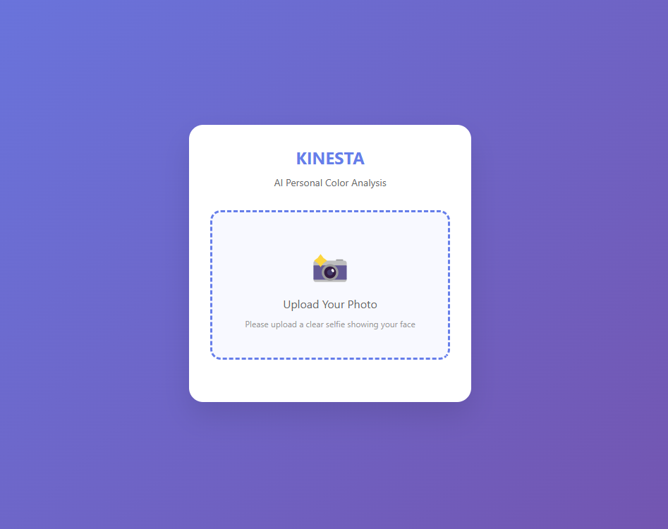
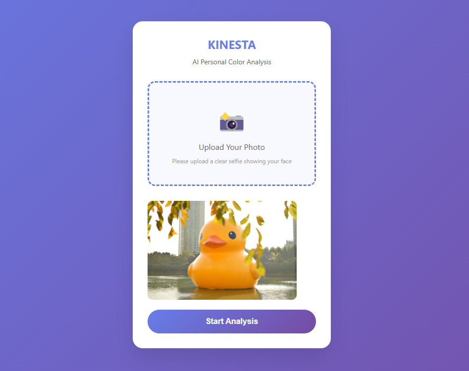
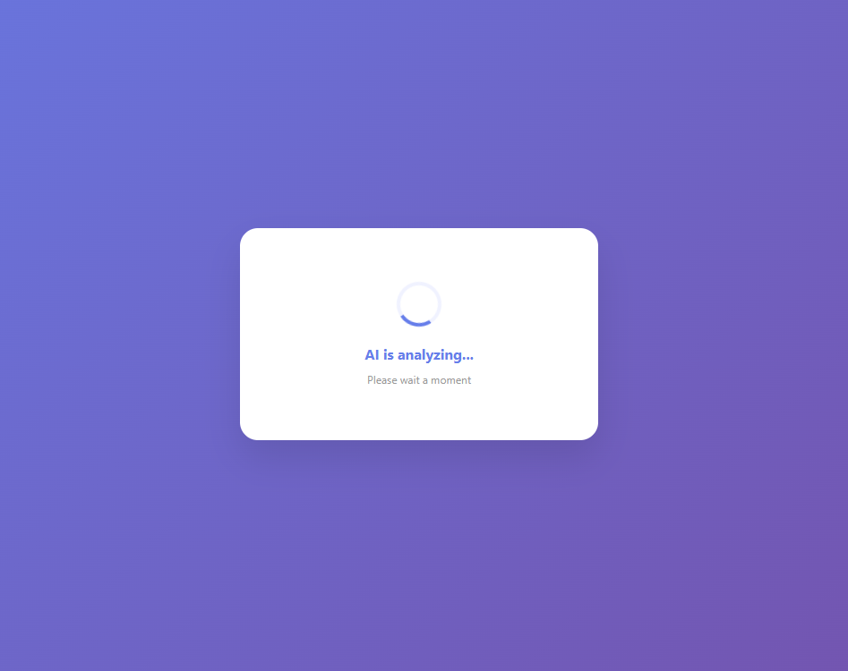
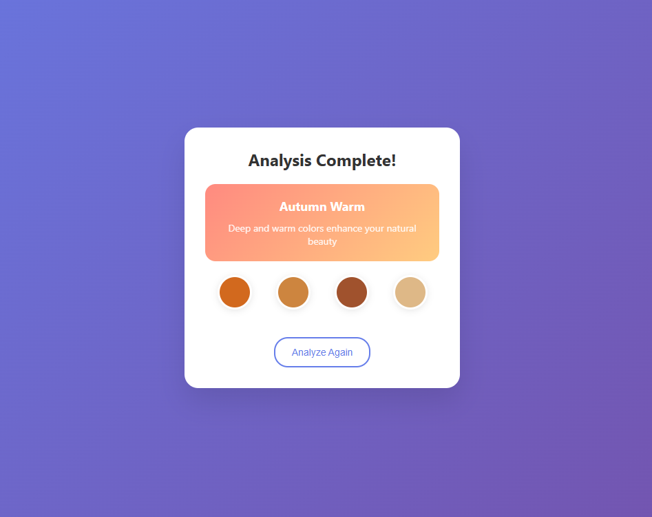

# Skin Analyzer MVP

An IoT-enabled beauty device with modular tips for skin diagnostics and real-time data sync.
Prototype for a skin analysis device - 3D Model and conceptual design

# Beauty Device Mockup Design

## 📋 Project Overview
IoT-enabled beauty device with interchangeable measurement tips for skin analysis and monitoring.

# Skin Analyzer MVP
> An IoT-enabled beauty device MVP with modular measurement tips, designed
> for precision skin diagnostics and real-time monitoring.

## 🖼️ Hardware Mockup

## 🚀 Interactive Prototype
[View Live Demo](https://minaverse-dev.github.io/skin-analyzer-mvp/index.html)

A live frontend prototype simulating the web-based skin analysis process.

**Features**:
- File upload (drag & drop supported)
- Simulated AI analysis flow
- Responsive UI for desktop
- CSS animations and smooth transitions  
  
> Vanilla JavaScript beauty tech prototype with zero dependencies.
> Features file upload, drag-and-drop API, CSS animations, and responsive design.
> Clean code architecture with modern ES6+ and mobile-first approach.

## Browser Compatibility
- ✅ Chrome, Firefox, Safari (Desktop)
- ⚠️ Mobile browsers (limited support)

## 📱 Web Application Flow

| Upload Screen | File Selected |
|:---:|:---:|
|  |  |

| AI Processing | Results |
|:---:|:---:|
|  |  |

### 🔍 Design Features
- ✍️ **Ergonomic** pen-type form for comfort
- 🔁 **Modular tips**: microscope, humidity sensor, etc.
- 🧠 **Reverse engineered** professional mechanism
- 🌐 **IoT connectivity** for real-time sync

### 📊 Technical Specifications

| Feature             | Detail                                      |
|---------------------|---------------------------------------------|
| Measurement Tips    | Microscope, Temp/Humidity sensor            |
| Connectivity        | Bluetooth / WiFi                            |
| Integration         | Notion API, cloud storage compatible        |
| Safety              | Non-invasive contactless sensor system      |

## 🔧 Development Status
- [x] Reverse engineering completed
- [x] 3D CAD modeling (Fusion 360)
- [x] Mockup design finalized
- [ ] Electronic component integration
- [ ] IoT module development
- [ ] Patent application filing

## 🎯 Next Steps
1. Sensor integration design
2. IoT connectivity implementation  
3. Data management system development
4. Patent application submission

---
*This project represents an innovative approach to personal beauty device technology, combining traditional measurement methods with modern IoT capabilities.*

> An IoT-enabled beauty device MVP 
> with modular measurement tips, designed 
> for precision skin diagnostics and real-time monitoring.
