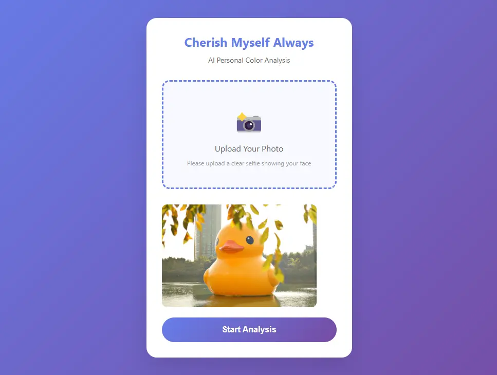

# Beauty Scanner MVP

> An IoT-enabled beauty device with modular tips for skin diagnostics and real-time data sync.

## 🖼️ Hardware Mockup

## 🚀 [Live Demo](https://minaverse-dev.github.io/beauty-scanner-mvp/)

💻 A live frontend prototype simulating the web-based beauty scanning process.  
📸 We recommend taking a real-time photo for accurate color analysis.  
🔒 No photo data is collected. It's just HTML.

### Features
- Camera-based photo input
- Interactive AI analysis demo
- Responsive UI for desktop
- CSS animations and smooth transitions

> Vanilla JavaScript beauty tech prototype with zero dependencies.  
> Features file upload, drag-and-drop API, CSS animations, and responsive design.  
> Clean code architecture with modern ES6+ and mobile-first approach.

### Browser Compatibility
- ✅ Chrome, Firefox, Safari (Desktop)

## 📱 Web Application Flow

| Upload Screen | File Selected |
|:---:|:---:|
|  |  |

| AI Processing | Results |
|:---:|:---:|
|  |  |

## 🔍 Design Features

- 🧠 **Computer Aided Engineered** professional mechanism
- 🌐 **IoT connectivity** for real-time sync

## 📊 Technical Specifications

| Feature             | Detail                                      |
|---------------------|---------------------------------------------|
| Connectivity        | Bluetooth / WiFi                            |
| Integration         | Notion API, cloud storage compatible        |
| Safety              | Non-invasive contactless sensor system      |

## 🔧 Development Status

- [x] Computer Aided Engineering completed
- [x] 3D CAD modeling (Fusion 360)
- [x] Mockup design finalized
- [ ] Electronic component integration
- [ ] IoT module development
- [ ] Patent application filing

<h2>🯠Next Steps</h2>

1. Multi-device Charging Dock System (in development)
2. Sensor integration design
3. IoT connectivity implementation
4. Data management system development
5. Patent application submission

## 🚧 The Other Projects in Development

### Personal Color Analysis Platform (2025)
- Advanced **AI-driven personal color analysis** web application
- Integration of body composition metrics and skin tone assessment
- Mobile-first React interface with real-time analysis
- Gamified wellness ecosystem with point rewards

*Demo version nearing completion (June 29, 2025)*  
*Repository will be made public following beta completion*

---

*This project represents an innovative approach to personal beauty device technology, combining traditional measurement methods with modern IoT capabilities.*

## 🚀 Deployment History - Cherish Myself Always 
| Date | Version | Component | Status | Files | Description |  
|------|---------|-----------|--------|-------|-------------|  
| 2025-07-17 | v0.1.3 | Software | ✅ Updated | index.html | Rename: Skin Analyzer MVP → Beauty Scanner MVP / PNG to WebP  
| 2025-06-29 | v0.1.2 | Software | ✅ Updated | index.html | Rebranding: KINESTA → Cherish Myself Always / PNG to WebP  
| 2025-06-26 | v0.1.1 | Software | ✅ Updated | index.html | Web interface improvements  
| 2025-06-26 | v0.1.0 | Hardware | ✅ Updated | skin-scanner-mockup-v1.webp | Initial device mockup design  

